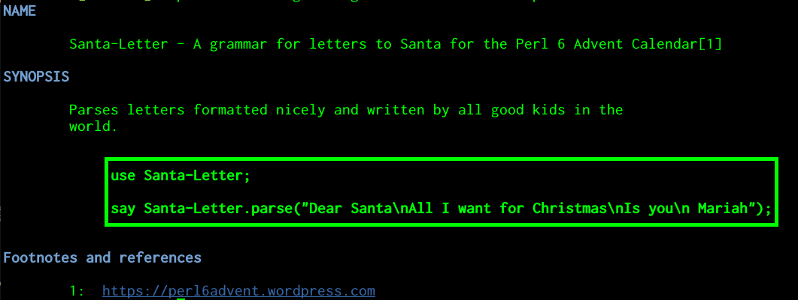
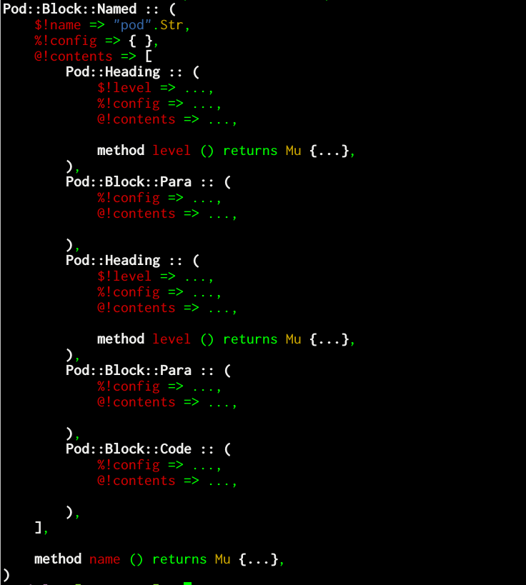

# Like 6 Perls in a Pod: document everything

Christmas season was approaching, and Santa was in a gloomy
mood. His inbox was full with letters from boys and girls coming from
all over.

But.

Were they letter to Santa? Was the kid properly identified by signature, so that
you sent the gifts to the proper person and not someone else who might
not deserve them? Were them addressed to Santa, and not any of those
impostors, the Easter Bunny, or, even worse, the Three
So-Called-I-don't-know-why-Wise-Men from Orient? Worst of all, did
*he* personally have to check all that stuff all by his royal and
hallowed self?

No.

Perl 6 came to the rescue with the following
[grammar](https://docs.perl6.org/syntax/Creating%20grammars):

```perl6
unit grammar Santa-Letter;

token TOP { <dear> \v+ <paragraph> [\v+ <paragraph>]* \v+ <signature>\v*}
token paragraph { <superword>[ \h+ <superword>]+ }
token superword { <word> | <enhanced-word> }
token word { \w+ }
token enhanced-word { <word> [\,|\.|\:] }
token dear {Dear \h+ [S|s]anta [\,|\:]? }
token signature {\h+ \w+ \h* \w* }
```

This [unit](https://docs.perl6.org/syntax/unit) declares a letter to
Santa as a salutation, followed by one or more paragraphs, and
finally, a `signature`, which should be preceded by an horizontal
whitespace as indicated by `\h`.

Letters such as this one:

```
Dear Santa:

This year I have been a really good boy, I have been in all Squashathons.

So I want a plush Camelia studded with diamonds.

 JJ
```

A simple script will use that grammar and get the signature in a
single letter:

```perl6
use Santa-Letter;

sub MAIN ( Str $file = "letter.txt" ) {
    my $letter =$file.IO.slurp;
    my $parsed = Santa-Letter.parse($letter);
    say $parsed<signature>.trim;
}
```

That was good and well, but Santa needed to get that data into the
North Pole's CRM together with the letter and index everything up, and
at the same time he had to deal with suppliers for whom the trade
wards had brought havoc... So he he called his closest IT elf and ask
him, in so many words, to do that kind of thing.

After that speech, the IT elf stood there, his ears aquiver.

"What?", Santa growled. In a hallowed way, of course.

The pointed part of the ears reddened and, with the quivering,
irradiated heat so that a small icicle melted and fell down to the
earth.

"You can read the source, right?"

Rudolf, who had been awakened by the noise of the icicle melting,
because that was one of his superpowers, intervened

## Most people can read source, but everyone can read the documentation.

Said Rudolph.

"And everyone should write that documentation, too", admonished,
bobbing his head with the red-tipped nose on the front.

Santa mumbled, but eventually checked out the master branch of his
Santa-Letter grammar and set down to work on it. Using, of course, Pod
6

## Pod 6 stands for "Plain Old documentation for Perl 6"

And it (clearly) not an
acronym. [Pod6](https://docs.perl6.org/language/pod) is a DSL that helps Perl 6 coders
write documentation. It's a markup language that uses `=` to start
commands and `<>` for paragraph-level markup. We'll get to that, but
for the time being, Santa realized that one of the best things was how
it integrates with Perl 6 itself. So he did a second iteration of his
examining program thus:

```perl6
#| This reads a letter file
sub MAIN ( Str $file = "letter.txt" ) {
    my $letter =$file.IO.slurp;
    my $parsed = Santa-Letter.parse($letter);
    say $parsed<signature>.trim;
}
```

There's a funny sign, `|`, in that comment. That sign ties it to the
code behind the comment. And in this case, it's the `MAIN` sub.

Santa released to production the program. The IT elf tried to run the
program,

	./get-signed.p6 --help

and he obtained:

```
Usage:
  ./get-signed.p6 [<file>] -- This reads a letter file
```

"Some documentation is better than no documentation", he thought. But
that was not nearly enough. He entered the North Pole ticketing
system, based entirely in free software, and he requested more
documentation and assigned the task to Santa. Santa protested loudly,
but complied.

```perl6
#|{ This reads a letter file in text format.
With no arguments, it will read the C<letter.txt> file.
}
sub MAIN ( Str $file = "letter.txt" ) {
    my $letter =$file.IO.slurp;
    my $parsed = Santa-Letter.parse($letter);
    say $parsed<signature>.trim;
    say $=pod[0].perl;
}
```

This printed the same message when invoked with `--help`. And it was
documentation. When running

    perl6 --doc get-signed.p6

it printed:

```
sub MAIN(
	Str $file = "letter.txt", 
)
This reads a letter file in text format. With no arguments, it will read the C<letter.txt> file.
```

So Perl 6 understands the comment and the code attached to it, and
automatically pretty-prints both. Documenting a routine  is as easy as
this.

Besides, when run on an actual file, the last sentence kicked it, and
it printed:

```
Pod::Block::Declarator.new(WHEREFORE => sub MAIN (Str $file = "letter.txt") { #`(Sub|81308800) ... }, config => {}, contents => [])
```

Unlike other DSLs used for comments in other languages, such as
Markdown or Pod itself in Perl 5, Pod 6 not only is a DSL for
comments, it's part of Perl 6 itself, and thus, it's interpreted by
the Perl 6 parser, its internal structures available for introspection
in the `$=pod` variable. In this case, the comment is a
[`Pod::Block::Declarator`](https://docs.perl6.org/type/Pod::Block::Declarator),
and that data structure includes the `WHEREFORE` key which contains
the declared function and the comment. However, `contents` and
`config` are empty. Which they shouldn't.

What's more, the little bit of actual formatting used in the comment
does not work. Not to mention the actual module was not really
documented. Now it was Santa who was not happy.

## Adding documentation to a module.

Writing documentation is probably the first thing you should do before
writing the actual code. Documentation is for the module clients, but
first and foremost, it's a guide for the author, a roadmap of what the
module should do and how it should do it. As seen above, documenting
individual methods or routines is quite easy with Pod 6; however, a
*big picture* view of the module is also convenient. And here's the
Pod for `Santa-Letter`

```perl6
=begin pod

=head1 NAME

Santa-Letter - A grammar for letters to Santa for the L<Perl 6 Advent Calendar|https://perl6advent.wordpress.com>

=head1 SYNOPSIS

Parses letters formatted nicely and written by all good kids in the world.

=end pod
```

Conveniently placed at the end of the file, when invoked with `perl6
--doc Santa-Letter.pm6`, or simply `perl6 --doc Santa-Letter` if it
has been installed, or even `p6doc Santa-Letter` if the `perl6/doc`
is present, will write something like:

```
NAME

Santa-Letter - A grammar for letters to Santa for the Perl 6 Advent
Calendar

SYNOPSIS

Parses letters formatted nicely and written by all good kids in the
world.
```

But you will notice here that there was a piece of markup that has
been eliminated in this type of output. `L<>` creates links, but it
obviously does so only if the output format supports that. So let's
try one of those:

    perl6 --doc=HTML Santa-Letter.pm6

will output a good amount of code, among which this line:

    <p>Santa-Letter - A grammar for letters to Santa for the <a href="https://perl6advent.wordpress.com">Perl 6 Advent Calendar</a></p>

clearly shows the output of the link.

As a matter of fact, this command will use the `Pod::To::HTML` module
to convert the Pod data structures to HTML. Using any other thing will
call the corresponding module, and there are [many modules available
on the ecosystem](https://modules.perl6.org/search/?q=pod%3A%3Ato). For
instance,
[`Pod::To::Pager`](https://gitlab.com/tyil/perl6-pod-to-pager) will
use the system's pager to make stuff a bit more beautiful.

    perl6 --doc=Pager Santa-Letter.pm6 

will result in this



This documentation, besides, follows the convention used in all
modules. `NAME` should describe the name and a short oneliner that
tells what the module is about, while `SYNOPSIS` includes a longer
description. While that's good, a real piece of documentation should
include examples.

```perl6
=begin code

use Santa-Letter;

say Santa-Letter.parse("Dear Santa\nAll I want for Christmas\nIs you\n Mariah");

=end code
```

Examples are included in `code` blocks, which from the point of view
of Pod6,
are [`Pod::Block::Code`](https://docs.perl6.org/type/Pod::Block::Code)
objects. Which is a nice thing, actually. Let's add this little
snippet of code to our grammar:

    our $pod = $=pod[0];

Grammars are classes, and they have class-scoped variables. We can't
export the `$=pod` variable to avoid clashing with others, but we can
export it and then use it from our program that:

    say $Santa-Letter::pod.perl;

Or, even better,
install [`Data::Dump`](https://github.com/tony-o/perl6-data-dump) and
write something like this:

    say Dump( $Santa-Letter::pod, :indent(4), :3max-recursion );
    
which uses the `pod` class variable we have declared, and prints it
this way:



This tree, which could be called the POM (Pod Object Model), includes,
besides the known `name` and `config` metadata that goes with every
block, an array of Pod6 blocks at the same level. Every one has the
generic attributes plus specific attributes, like `level` in the case
of [headings](https://docs.perl6.org/type/Pod::Heading). Anyway, the
interesting thing is that the code itself we are using as an example
is available as `contents` of the `Pod::Block::Code` object.

"Hum", thought Santa. We could do one better with this. Can we
actually check that the included code works? Yes we can! Let's expand
the `SYNOPSIS` section:

```perl6
=head1 SYNOPSIS

Parses letters formatted nicely and written by all good kids in the world.

=begin code

use Santa-Letter;

say Santa-Letter.parse("Dear Santa\nAll I want for Christmas\nIs you\n Mariah");

=end code

You can also access particular elements in the letter, as long as they are included on the grammar

    my $letter="Dear Santa,\nI have not been that good.\nJust a paper clip will do\n Donald"
    say Santa-Letter.parse($letter)<signature>

Also

=for code :notest :reason("Variable defined above")
say "The letter signed by ", Santa-Letter.parse($letter)<signature>,
    " has ", Santa-Letter.parse($letter)<paragraph>.elems, " paragraphs";
    
=end pod
```

Code can be represented in different ways in a Pod. The first is
known; the second uses simply indentation, *à la* Markdown, to denote
the same thing. We can also
use [`=for`](https://docs.perl6.org/language/pod#Paragraph_blocks)
paragraph blocks, which is declared in this case with the `code` type
and will continue until the next blank line. It's an abbreviated way
that does not need the `=end` directive. But there's something more
there: the configuration variables `:notest :reason("Variable defined
above")`. These configuration variables are arbitrary, and we can add
as many as we want. They will go to the `config` attribute of the
block, and we can work with them. That's exactly what we will do in
this script that will process the code examples:

```perl6
for $Santa-Letter::pod.contents -> $block {
    next if $block !~~ Pod::Block::Code;
    if $block.config<notest> {
        say "→ Block\n\t"~ $block.contents
            ~ "\n\t❈ Not tested since \'" ~ $block.config<reason> ~ "\'";
    } else {
        my $code = $block.contents.join("");
        say "→ Block\n\t"~ $block.contents;
        try {
            EVAL $code;
        }
        if ( $! ) {
            say "\n\t✘ Produces error \"$!\"", "\n" xx 2;
        } else {
            say "✔ is OK\n";
        }
    }
}
```

As we have seen in the structure above, the `contents` attribute will
include an array of first-level Pod blocks, which in our case include
all the three blocks we want to evaluate (or maybe not). Non-code
blocks are skipped (but could be checked for spelling, too). We do two
interesting things here: we check for the `notest` flag in the
configuration via `$block.config<notest>`, and we print some note if
that's the case, but if it should be tested, then it's `EVAL`ed (we
need the `use MONKEY-SEE-NO-EVAL` pragma for that.

Santa runs that on the documentation, and lo and behold!

```
→ Block
	my $letter="Dear Santa,\nI have not been that good.\nJust a paper clip will do\n Donald"
say Santa-Letter.parse($letter)<signature>

	✘ Produces error "Two terms in a row across lines (missing semicolon or comma?)"(
 
)
```

He was at once happy and humbled. A simple semicolon was spoiling the
quality of the examples. It's always the semicolon. He put the
semicolon back in the examples, and the module documentation passed
the test with flying colors.

## Back to production

Provided with
this
[documented module](https://github.com/JJ/my-perl6-examples/blob/master/grammars/Santa-Letter.pm6),
the IT elf was moderately happy and his ears stopped quivering and
reddening. He could also use documentation for every
one of the tokens, but enough was enough and at least he had some
examples to get the application going. 
Rudolf was soundly asleep, and now he would have to write
the bridge between the letter-receiving microservice and the customer
relationship macroservice. 
He would probably
use [Cro](https://cro.services/) for that, but that's a topic for
another day. 
